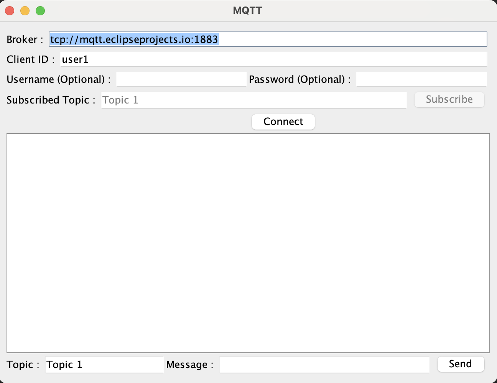
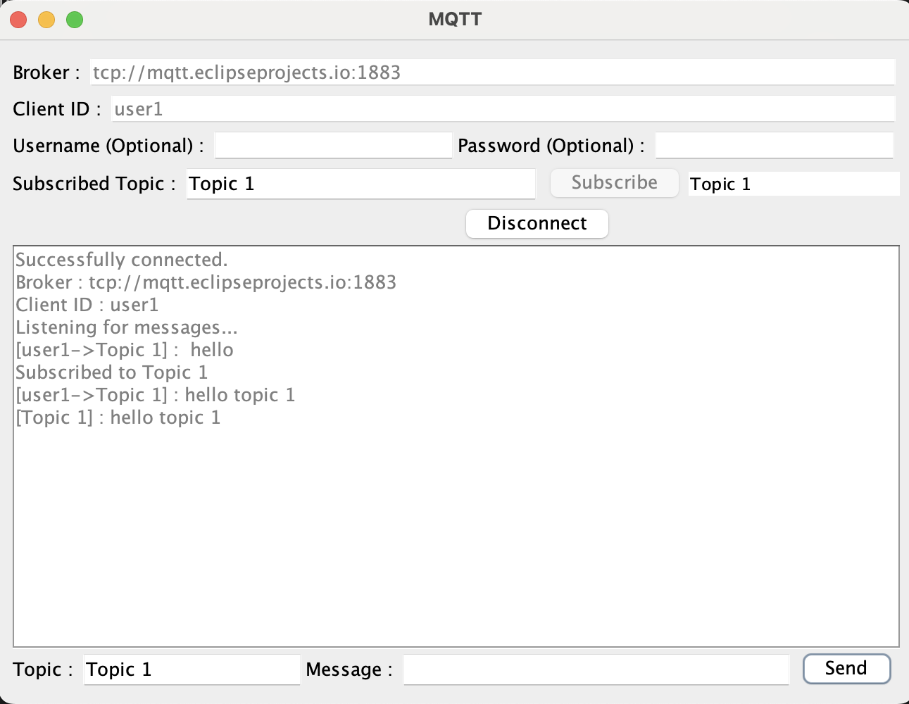

# Java MQTT Client

This project is a simple Java Swing UI application that creates an MQTT client for publishing messages to different subscriber topics.

## Getting Started
Just run main.java and it should work! Its just that simple.

Screenshot of UI:

 

**\* To create your own MQTT Broker, navigate to [mqtt_docker_broker](https://github.com/YuLiangGoh/mqtt_docker_broker) for more information.**

## Built With

* [Java](https://www.java.com/) - The programming language used
* [Swing](https://docs.oracle.com/javase/tutorial/uiswing/) - The graphical library used
* [MQTT](http://mqtt.org/) - The messaging protocol used

## Authors

* **Zachary** - *Initial work* - [YuLiangGoh](https://github.com/YuLiangGoh)

## License

This project is licensed under the MIT License - see the [LICENSE.md](LICENSE.md) file for details